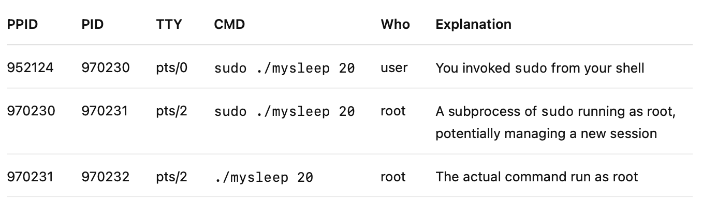

# 🧪 Linux File permissions

## 🎯 Objective

Learn to manage Linux file permissions, understand setuid/setgid, and recognize associated security risks.

---

## 🧰 Prerequisites

- Linux system (Ubuntu/Debian/CentOS)
- `sudo` access
- Basic shell familiarity

---

In Linux, everything is a file, like:

- Binary application code
- Data
- Configuration
- Logs
- Devices

Permissions on such files determine which users are allowed to access those files and what actions they can perform on the files.

Each file and directory has three user-based permission groups:

- __u__ - owner – The _Owner_ permissions apply only to the owner of the file or directory, they will not impact the actions of other users.
- __g__ - group – The _Group_ permissions apply only to the group that has been assigned to the file or directory, they will not affect the actions of other users.
- __a__ - all users – The _All Users_ permissions apply to all other users on the system, this is the permission group that you want to watch the most.

The Permission Types that are used are:

- __r__ – Read
- __w__ – Write
- __x__ – Execute

The permissions are displayed as: `-rwxrwxrwx 1 owner:group`.
Using `ls -l test.txt` would result in the following:

```bash
-rw-r--r-- 1 myuser mygroup test.txt
```

1. The first character is the special permission flag
2. The following set of three characters (rwx) is for the _owner_ permissions
3. The second set of three characters (rwx) is for the _group_ permissions
4. The third set of three characters (rwx) is for the _all users_ permissions
5. Following the grouping the number displays the number of hard links to the file
6. The last piece is the _owner_ and _group_ assignment

The file owner and group can be changed using the `chown` command. By performing `chown myuser:mygroup test.txt` the owner of the file _test.txt_ would be _myuser_ and the group would be set to _mygroup_.

The file permissions are edited by using the command `chmod`. You can assign the permissions explicitly or by using a binary reference.
You may add the _read_ and _write_ permission to the group using `chmod g+rw text.txt`. To remove the same permissions for all other users you would type `chmod o-rw text.txt`.

---

## 🔹 Lab 1: Basic File Permissions

### Step 1: Create a file and set permissions

Create a new file and check the default permissions:

```bash
touch myfile1.txt
ls -l myfile1.txt
```

By default the owner (the user `novatec`) and the group (`novatec`) have `read`and `write` access

```bash
-rw-rw-r-- 1 novatec novatec 0 May 10 12:32 myfile1.txt
```

But here we want to have `write` access for the owner only.
So let's do this:

```bash
chmod g-w myfile1.txt
ls -l myfile1.txt
```

✅ __Expected:__ Only the owner can read/write.

```bash
-rw-rw-r-- 1 novatec novatec 0 May 10 12:32 myfile1.txt
```

### Step 2: Cleanup myfile1.txt

Remove the test file

```bash
rm myfile1.txt
```

---

## 🔹 Lab 2: Understanding Numeric Permissions

You may also specify the complete file permissions using a binary reference instead:
The numbers are a binary representation of the rwx string.

- r (read) = 4
- w (write) = 2
- x (execute) = 1

So you could also perform `chmod 644 test.txt` instead of `chmod g-w,a-w,u+w test.txt`.

### Step 1: Create a file and set numeric permissions

Create a new file again and check the default permissions:

```bash
touch myfile2.txt
ls -l myfile2.txt
```

By default the owner (the user `novatec`) and the group (`novatec`) have `read`and `write` access

```bash
-rw-rw-r-- 1 novatec novatec 0 May 10 12:32 myfile2.txt
```

But here we want to have `write` access for the owner only.
So let's do this, but this time using numeric style:

```bash
chmod 644 myfile2.txt
ls -l myfile2.txt
```

✅ __Expected:__ Only the owner can read/write.

```bash
-rw-r-r-- 1 novatec novatec 0 May 10 12:32 myfile2.txt
```

Using the numeric style for setting permissions is much faster and easier compared to the first alternative used in the first lab.

### Step 2: Cleanup myfile2.txt

Remove the test file again

```bash
rm myfile2.txt
```

---

## 🔹 Lab 3: Using `umask` to Set Default Permissions

`umask` sets the calling process's file mode creation mask (umask) to `umask & 0777` (i.e., only the file permission bits of mask are used).
The `umask` is used by system calls that create files, i.e. `mkdir` or `touch`.
Same as the file permissions, in the `umask` mode value, the first digit, 0 is called the sticky bit, it is a special security feature.
The next three digits represent the octal values of the umask for a file or directory.

In our lab we will ignore the first digit and only focus the last 3 digits for file/directory permissions.

In practical terms to get the effective file permissions of a `umask`mode set you calculate

- For directories: 777 - _umask mode_, i.e. 777 - 002 = 775 (`drwxrwxr-x`)
- For file: 666 - _umask mode_, i.e. 666 - 002 = 664 (`-rw-rw-r--`)

### Step 1: Check current umask

Check current `umask`:

```bash
umask
```

By default this should return the following value

```bash
0002
```

With this umask value creating a new directory or a new file would have permissions set as described in the section above (directory=775, file=664).

### Step 2: Change umask

Let's change the umask to a bit more restrictive value:

- For directories: 777 - 022 = 755 (`drwxr-xr-x`)
- For files: 666 - 022 = 644 (`-rw-r--r--`)

```bash
umask 0022
mkdir newdir
touch newfile.txt
ls -l
```

✅ New directories and files will have permissions limited by `umask`.

```bash
drwxr-xr-x 2 novatec novatec 4096 May 10 13:28 newdir
-rw-r--r-- 1 novatec novatec    0 May 10 13:27 newfile.txt
```

### Step 3: Cleanup and reset umask to default

Finally set the default umask again.

```bash
umask 0002
```

Finally, clean up files and directory

```bash
rmdir newdir
rm newfile.txt
```

---

## 🔹 Lab 4: Using special permissions using setuid and setgid

When executing a file, usually the process that gets started inherits your user ID.
If the file has the setuid/setgid bit set, the process will have the user/group ID of the file’s owner/group instead.

We will try that using the `sleep` command. Because we will change permissions first, we will copy the binary to our own one experiment with. To check the installation path of the `sleep` file perform a `which sleep`.
With this path perform the copy command:

```bash
cp /usr/bin/sleep ./mysleep
```

Now let's check the file permissions for the _mysleep_ file:

```bash
ls -l mysleep
```

This should return something like this:

```bash
-rwxr-xr-x 1 novatec novatec 35336 May 10 13:32 mysleep
```

### Step 1: Execute mysleep with my own user

Normally, when you execute a file, the process that gets started inherits your user ID and group ID.

If you now execute it in a terminal with

```bash
./mysleep 20
```

And then execute this in another terminal:

```bash
ps ajf
```

Then this will run with the root user id:

```bash
PPID     PID    PGID     SID TTY        TPGID STAT   UID   TIME COMMAND
952121  952124  952124  952124 pts/0     969009 Ss    1000   0:00 -bash
 952124  969009  969009  952124 pts/0     969009 S+    1000   0:00  \_ ./mysleep 20
```

You can check for your own user id (UID) using the `id` command:

```bash
id
```

This would return something similar like this:

```bash
uid=1000(novatec) gid=1000(novatec) groups=1000(novatec),4(adm),24(cdrom),27(sudo),30(dip),105(lxd),988(docker)
```

### Step 2: Execute mysleep as a root user

If you now execute it as a root user in a terminal with

```bash
sudo ./mysleep 20
```

And then execute this in another terminal:

```bash
ps ajf
```

Then this will run with the root user id:

```bash
PPID     PID    PGID     SID TTY        TPGID STAT   UID   TIME COMMAND
952121  952124  952124  952124 pts/0     969469 Ss    1000   0:00 -bash
 952124  969469  969469  952124 pts/0     969469 S+       0   0:00  \_ sudo ./mysleep 20
 969469  969470  969470  969470 pts/2     969471 Ss       0   0:00      \_ sudo ./mysleep 20
 969470  969471  969471  969470 pts/2     969471 S+       0   0:00          \_ ./mysleep 20
```

#### 🧱 Excursus: Breakdown of process output



### Step 3: Execute mysleep with setuid bit set

Now with setuid bit set:

```bash
chmod +s mysleep
```

Check again with

```bash
ls -l mysleep
```

```bash
-rwsr-sr-x 1 novatec novatec 35336 May 10 13:32 mysleep
```

If you now execute this in one terminal:

```bash
sudo ./mysleep 20
```

And execute this in another terminal:

```bash
ps ajf
```

Then you will see that even when executing as root, the command is run using the other user id:

```bash
PPID     PID    PGID     SID TTY        TPGID STAT   UID   TIME COMMAND
952121  952124  952124  952124 pts/0     970230 Ss    1000   0:00 -bash
 952124  970230  970230  952124 pts/0     970230 S+       0   0:00  \_ sudo ./mysleep 20
 970230  970231  970231  970231 pts/2     970232 Ss       0   0:00      \_ sudo ./mysleep 20
 970231  970232  970232  970231 pts/2     970232 S+    1000   0:00          \_ ./mysleep 20
```

This bit is typically used to give a program privilege that it needs but is not
usually extended to regular users.
Because _setuid_ provides a dangerous pathway to privilege escalation, some container
image security scanners report on the presence of files with the _setuid_ bit set.

One example would be the `passwd` command which runs by default with the root user id.

```bash
-rwsr-xr-x 1 root root 64152 May 30  2024 /usr/bin/passwd
```

Modern linux systems are much more restrictive by default with using the setuid bit with the root user.

---

## 🔹 Lab 5: Setgid and Directory Behavior

Create a directory and setgid:

```bash
mkdir setgid-dir
mkdir test-dir
chgrp docker setgid-dir
chgrp docker test-dir
chmod 2775 setgid-dir
ls -ld setgid-dir
ls -ld test-dir
```

✅ `s` appears on group permissions of the `setgid-dir` directory only.

```bash
drwxrwsr-x 2 novatec docker 4096 May 10 14:13 setgid-dir
drwxrwxr-x 2 novatec docker 4096 May 10 14:13 test-dir
```

Files created inside `test-dir` do NOT inherit the directory's group:

```bash
cd test-dir
touch file1.txt
ls -l
```

```bash
-rw-rw-r-- 1 novatec novatec 0 May 10 14:15 file1.txt
```

But files created inside `setgid-dir` inherit the directory's group:

```bash
cd setgid-dir
touch file1.txt
ls -l
```

```bash
-rw-rw-r-- 1 novatec docker 0 May 10 14:16 file1.txt
```

✅ Group ownership is inherited automatically.

Finally clean up everything:

```bash
rm -R setgid-dir
rm -R test-dir
```

---

### 🚨 Attack Potential

- If writable by multiple users, can lead to group privilege escalation or unauthorized access.

---

## 🔹 Lab 6: Finding All Setuid and Setgid Binaries

Audit the system:

```bash
find / -perm -4000 -type f 2>/dev/null  # Setuid
find / -perm -2000 -type f 2>/dev/null  # Setgid
```

✅ Review carefully — attackers often target vulnerable setuid/setgid binaries.

---

## ✅ Wrap-Up

- ✅ Learned about Linux file permissions
- ✅ Created and used setuid/setgid binaries
- ✅ Understood real attack potential
- ✅ Practiced mitigation and auditing techniques

---
