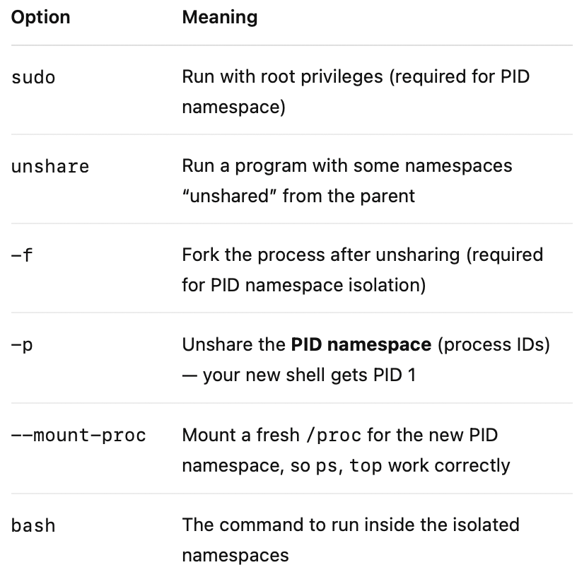

# 🧪 Linux Namespaces

## 🎯 Objective

Learn how Linux namespaces isolate system resources by creating isolated environments using the unshare and nsenter tools.

## 🧰 Prerequisites

- Linux system (Ubuntu/Debian/CentOS)
- Tools: `util-linux` (`unshare`, `nsenter`), `procps`, `iproute2`, `coreutils`
- Root or `sudo` access recommended

## Install required tools:

```bash
sudo apt update
sudo apt install util-linux procps iproute2 -y
```

---

__Linux namespaces__ control what a process can see.  
__CGroups__ (see other section [Linux CGroups](./#linux-cgroups.md)) control the resources that a process can use.  
Both mechanisms form the basis of Containers.

Linux currently provides the following namespaces:

- Unix Timesharing System (UTS): This namespace is responsible for the hostname and domain names.
- Process IDs
- Mount points
- Network
- User and group IDs
- Inter-process communications (IPC)
- Control groups (cgroups)

You can see all namespaces on your machine using the `lsns` command.
Try also to run this command using root `sudo lsns`, then you are able to see more details.

```bash
        NS TYPE   NPROCS   PID USER            COMMAND
4026531841 mnt       136     1 root            /sbin/init
4026532146 mnt         1   226 root            ├─/usr/lib/systemd/systemd-udevd
4026532147 uts         1   226 root            ├─/usr/lib/systemd/systemd-udevd
4026532158 mnt         1   550 systemd-resolve ├─/usr/lib/systemd/systemd-resolved
4026532161 mnt         1   712 systemd-network ├─/usr/lib/systemd/systemd-networkd
4026532171 net         1   835 root            ├─/usr/libexec/accounts-daemon
```

By using the tool `unshare` you may run a process with some namespaces unshared from the parent
(i.e., simulating a linux container).

```bash
Usage:
 unshare [options] [<program> [<argument>...]]

Run a program with some namespaces unshared from the parent.

Options:
 -m, --mount[=<file>]      unshare mounts namespace
 -u, --uts[=<file>]        unshare UTS namespace (hostname etc.)
 -i, --ipc[=<file>]        unshare System V IPC namespace
 -n, --net[=<file>]        unshare network namespace
 -p, --pid[=<file>]        unshare pid namespace
 -U, --user[=<file>]       unshare user namespace
 -C, --cgroup[=<file>]     unshare cgroup namespace
 -T, --time[=<file>]       unshare time namespace
```

---

## 🔹 Lab 1: Isolating the hostname using a UTS namespace

So let's try to use the _UTS_ (Unix Timesharing System) namespace to isolate the hostname:

```shell
sudo unshare --uts bash
hostname
hostname isolatedhost
hostname
```

This opens a root shell in a new _UTS_ namespace.

```bash
root@afa01-vm-0:/home/novatec#
```

Let's try to set an isolated hostname in this shell:

```bash
hostname
hostname isolatedhost
hostname
```

In the output you should see that it really has set a new hostname

```bash
afa01-vm-0
isolatedhost
```

So, in the current shell we have our own hostname isolated by the _UTS_ namespace.  
Now open a new terminal and check the hostname. 

```bash
hostname
```

You will notice that the host still has its original name.

```bash
afa01-vm-0
```

✅ Hostname change is isolated.

Finally, just exit the root shell by typing `exit`.

---

## 🔹 Lab 2: Isolating the process id using a PID namespace

You can also use the _PID_ namespace to isolate the process id.

```bash
sudo unshare -fp --mount-proc bash
ps aux
```

Only a few processes show now, starting from PID 1. This simulates what a container would see: A trimmed-down process view.

```bash
USER         PID %CPU %MEM    VSZ   RSS TTY      STAT START   TIME COMMAND
root           1  0.0  0.1   8004  4368 pts/2    S    14:42   0:00 bash
root           8  0.0  0.1  11320  4432 pts/2    R+   14:42   0:00 ps aux
```

### 🔍 Excursus: Breakdown of Flags



✅ Simulates container-like PID isolation.

Finally, just exit the root shell by typing `exit`.

---

## 🔹 Lab 3: Isolating the network using a network namespace

First check the current network interfaces in the current shell:

```bash
ip a
```

You should see several interfaces here (i.e. lo, eth0 and docker)

```bash
1: lo: <LOOPBACK,UP,LOWER_UP> mtu 65536 qdisc noqueue state UNKNOWN group default qlen 1000
    link/loopback 00:00:00:00:00:00 brd 00:00:00:00:00:00
    inet 127.0.0.1/8 scope host lo
       valid_lft forever preferred_lft forever
    inet6 ::1/128 scope host noprefixroute 
       valid_lft forever preferred_lft forever
2: eth0: <BROADCAST,MULTICAST,UP,LOWER_UP> mtu 1500 qdisc mq state UP group default qlen 1000
    link/ether 60:45:bd:9f:61:c0 brd ff:ff:ff:ff:ff:ff
    inet 10.0.1.4/24 metric 100 brd 10.0.1.255 scope global eth0
       valid_lft forever preferred_lft forever
    inet6 fe80::6245:bdff:fe9f:61c0/64 scope link 
       valid_lft forever preferred_lft forever
3: docker0: <NO-CARRIER,BROADCAST,MULTICAST,UP> mtu 1500 qdisc noqueue state DOWN group default 
    link/ether 1a:46:74:13:74:fc brd ff:ff:ff:ff:ff:ff
    inet 172.17.0.1/16 brd 172.17.255.255 scope global docker0
       valid_lft forever preferred_lft forever
```

Now open a new shell in an isolated network namespace:

```bash
sudo unshare -n bash
ip a
```

This should show only the `lo` interface (loopback). Network is isolated. You can’t reach the outside world.

```bash
1: lo: <LOOPBACK> mtu 65536 qdisc noop state DOWN group default qlen 1000
    link/loopback 00:00:00:00:00:00 brd 00:00:00:00:00:00
```

✅ Network isolation achieved.

Finally, just exit the root shell by typing `exit`.

---

## 🔹 Lab 4: Inspect Namespace Links in `/proc`

```bash
ls -l /proc/$(echo $$)/ns
```

You’ll see symbolic links to namespace descriptors like mnt, uts, pid, etc.
These are the namespaces of the current shell process id (`echo $$` returns the PID of the current shell).

✅ Observe `mnt`, `uts`, `pid`, `net`, and other namespace descriptors.

---

## 🔹 Lab 5: Isolating the mount namespace

```bash
sudo unshare --mount bash
mkdir /tmp/mylab
mount -t tmpfs tmpfs /tmp/mylab
mount | grep mylab  # Should show your new mount
```

Now, in another terminal, run:

```bash
mount | grep mylab
```

Our new mount doesn’t appear outside the namespace.

✅ Mount is isolated from the host view.

Finally, just exit the root shell by typing `exit`.

---

## 🔹 Lab 6: Combine multiple Namespaces

```bash
sudo unshare -u -n -m -p -i -f --mount-proc bash
```

Now check in the same terminal:

```bash
hostname
ps aux
ip a
mount
```

All outputs reflect isolation from the host.
You will see that the hostname is isolated, the process id starts at 1, the network is isolated and the mount namespace is also isolated.

✅ Fully isolated namespace context.

Finally, just exit the root shell by typing `exit`.

---

## 🔹 Lab 7: Enter Another Process’s Namespace

Another option is the _nsenter_ tool that basically is intended
to run a program with namespaces of other processes.

```bash
sudo unshare -u -p -f --mount-proc bash
```

In the new isolated shell set a new hostname

```bash
hostname testhost
```

In another terminal run:

```bash
pid=$(pgrep -f unshare | tail -n 1)
sudo nsenter -t $pid -u bash
```

Now you’ve entered another process’s UTS namespace.

```bash
root@testhost:/home/novatec#
```

if you check for the hostname you should get the isolated hostname `testhost`.

```bash
hostname
```

`nsenter` opens up attack potential in containers as it is possible to enter a host namespace and perform a container escape. To mitigate this, `nsenter` command should not be installed inside containers and it should not be denied for attackers to install this in your container as well.

✅ Join and inspect the other process's namespace.

Finally, just exit both sub shells by typing `exit`.

---

## ✅ Wrap-Up

- Namespaces are the foundation of container isolation.
- Learned to use `unshare` and `nsenter` for namespace exploration
- Explored UTS, PID, MNT, NET, and combined namespaces
- Simulated container isolation mechanisms using native Linux features

---
