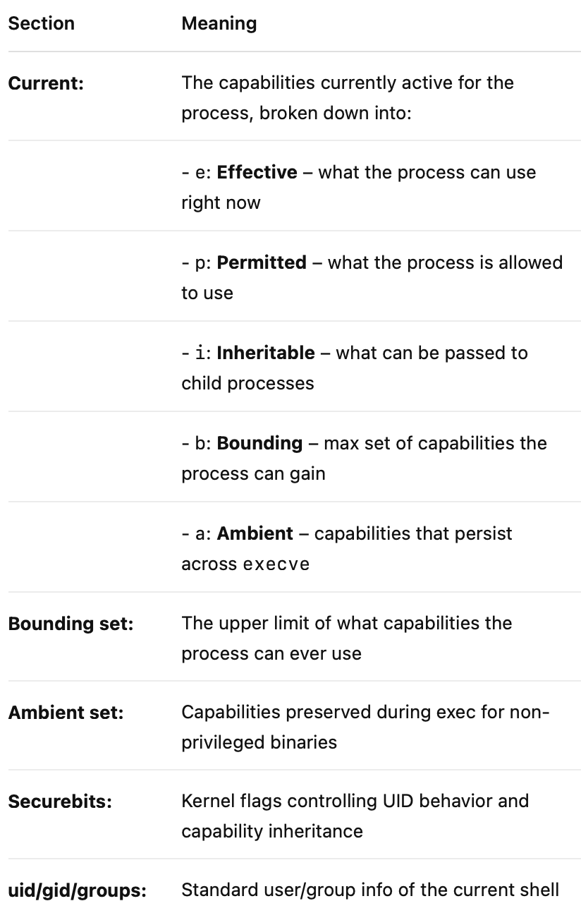

# 🧪 Understanding Linux Capabilities with Docker

## 🎯 Objective

Learn what Linux capabilities are, how containers use them, and how to manage them securely using Docker’s `--cap-add` and `--cap-drop` options.

---

## 🧰 Prerequisites

- Docker installed (`docker version` should work)
- Root or sudo access to run containers
- Tools: `capsh`, `iputils`, `libcap2-bin`

```bash
sudo apt update
sudo apt install libcap2-bin iputils-ping
```

---

## 🔹 Lab 1: View Capabilities Inside a Docker Container

### Step 1: Create and Start a custom container

Create this `Dockerfile` using vim or nano editors:

```Dockerfile
FROM ubuntu:latest
RUN apt update && apt install -y iputils-ping libcap2-bin
CMD ["bash"]
```

Build the docker container using:

```bash
docker build -t cap-container .
```

```bash
docker run --rm -it cap-container
```

### Step 2: Check capabilities

```bash
capsh --print
```

✅ **Expected:** Default set of capabilities shown (`cap_net_raw`, `cap_chown`, etc.)

#### Excursive: 🧠 Capsh Section Breakdown



You may also use the more easier approach to see the effective capabilities using this command:

```bash
getpcaps $$
```

---

## 🔹 Lab 2: Drop All Capabilities

### Step 1: Run a container with no capabilities

```bash
docker run --rm -it --cap-drop=ALL cap-container
```

### Step 2: Check no capabilities are set

```bash
capsh --print
```

### Step 3: Try actions that need privileges

```bash
ping -c 1 8.8.8.8
```

❌ **Expected:** `ping` fails because `cap_net_raw` is missing.

---

## 🔹 Lab 3: Add a Specific Capability

### Step 1: Add back `CAP_NET_RAW`

```bash
docker run --rm -it --cap-drop=ALL --cap-add=NET_RAW cap-container
```

### Step 2: Check NET_RAW capability is set

```bash
capsh --print
```

### Step 3: Try `ping` again

```bash
ping -c 1 8.8.8.8
```

✅ **Expected:** `ping` works with `CAP_NET_RAW` restored.

---

## 🔹 Lab 4: Compare with Privileged Containers

### Step 1: Run a privileged container

```bash
docker run --rm -it --privileged cap-container
```

```bash
capsh --print | grep cap_sys_admin
```

✅ **Expected:** All SYS_ADMIN capability is available. The container can do nearly anything the host can.

### Step 2: Try mounting inside a container

```bash
mkdir /mnt/test
mount -t tmpfs tmpfs /mnt/test
```

✅ **Expected:** Works with `CAP_SYS_ADMIN`; fails without it.

### Step 3: Check access to all (host) devices

```bash
ls -l /dev
```

✅ **Expected:** Privileged containers have access to almost all host devices (/dev/kvm, /dev/sda, etc.), unlike default containers.

---

## 🔹 Lab 5: Inspect Running Containers

### Step 1: Run a container in the background

```bash
docker run -d --cap-drop=ALL --name minimal alpine sleep 300
```

### Step 2: Inspect the container

```bash
docker inspect minimal | grep Cap -A 2
```

✅ **Expected:** `CapDrop` should list all dropped caps, `CapAdd` should be empty.

---

## ✅ Wrap-Up

- You explored capabilities in Docker and saw how they restrict or allow actions.
- You ran containers with minimal privileges (`--cap-drop=ALL`).
- You added capabilities only as needed (`--cap-add=...`).
- You compared privilege escalation using `--privileged`.

---
