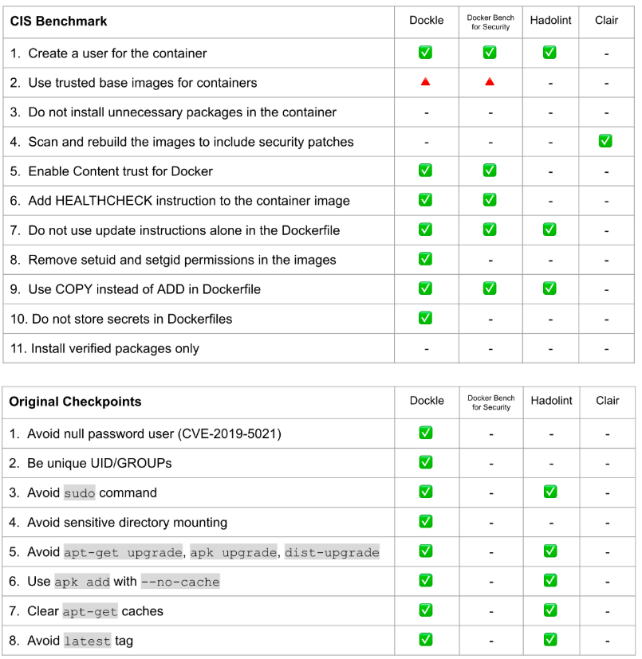

# Helpful Tools for Container and Kubernetes Security

## Signing

### Notary

[Docker Notary](https://github.com/notaryproject/notary) is a framework to sign and verify Docker container images.

### Sigstore & Cosign

[Sigstore](https://www.sigstore.dev) provides a way for software developers to sign off on what they build, without needing to jump through hoops or know tricky security protocols. And it’s a way for anyone using those releases to verify the signatures against a tamper-proof log.

It includes [Cosign](https://github.com/sigstore/cosign) for signing and verification of artifacts and containers, with storage in an Open Container Initiative (OCI) registry, making signatures and in-toto/SLSA attestations invisible infrastructure.

### In-Toto

[In-Toto](https://in-toto.io) is a framework to secure the integrity of software supply chains.
It ensures the integrity of a software product from initiation to end-user installation. It does so by making it transparent to the user what steps were performed, by whom and in what order.

## Static Code Analysis

### General IaC Tools

#### Checkov

[Chekov](https://github.com/bridgecrewio/checkov) is an open source static code analysis tool for infrastructure-as-code. It scans cloud infrastructure provisioned using Terraform, Terraform plan, Cloudformation, Kubernetes, Dockerfile and more.

#### KICS

[KICS](https://kics.io/) is an open source solution for static code analysis of Infrastructure as Code. KICS finds security vulnerabilities, compliance issues, and infrastructure misconfigurations in Infrastructure as Code solutions like Terraform, Kubernetes, Docker, Ansible or Helm.

### Container & Docker

#### Hadolint

[Hadolint](https://github.com/hadolint/hadolint) is a Dockerfile linter that helps you build best practice Docker images. The linter parses the Dockerfile into an AST and performs rules on top of the AST.

#### Dockle

[Dockle](https://github.com/goodwithtech/dockle) is a Container Image Linter for Security to help build the Best-Practice Docker Image.



### Kubernetes

#### Kubesec

[Kubesec](https://kubesec.io) is a Security risk analysis tool for Kubernetes resources.

You can install it as

- Docker container image at `docker.io/kubesec/kubesec:v2`
- Linux/MacOS/Win binary (get the latest release)
- Kubernetes Admission Controller
- Kubectl plugin

You can check your Kubernetes resources using:

```bash
kubesec scan k8s-deployment.yaml
```

#### Kube-Score

[Kube-Score](https://github.com/zegl/kube-score) is a tool that performs static code analysis of your Kubernetes object definitions (i.e., your YAML files).
You can install it from [Kube-Score](https://github.com/zegl/kube-score).

It can be installed using brew: `brew install kube-score`.

You can just verify e.g., a deployment definition like this:

```shell
kube-score score ./deploy.yaml
```

#### Popeye – A Kubernetes Cluster Sanitizer

Popeye is a utility that scans live Kubernetes cluster and reports potential issues with deployed resources and configurations.
Just head to the [Popeye website](https://github.com/derailed/popeye) to install it.

With that you just _Popeye_ a cluster using your current kubeconfig environment by typing:

```shell
popeye
```

## Kubernetes RBAC Tools

### Who-Can for Auditing RBAC

[Kubernetes' Role Based Access (RBAC)](https://kubernetes.io/docs/reference/access-authn-authz/rbac/) is not easy. A recommended helpful tool for auditing RBAC configuration is [AqueSecurity Who-Can](https://github.com/aquasecurity/kubectl-who-can).  
Just follow the instructions on the [Who-Can website](https://github.com/aquasecurity/kubectl-who-can) to install this.

After installing, you may for example just check who can create pods:

```shell
kubectl who-can create pods
```

### Look up role bindings with RBAC lookup

[RBAC Lookup](https://github.com/FairwindsOps/rbac-lookup) is a CLI that allows you to easily find Kubernetes roles and cluster roles bound to any user, service account, or group name.

With RBAC lookup you can just query for example the role bindings of the _default_ service account:

```shell
kubectl rbac-lookup default -k serviceaccount -o wide
```

### Rakkes

[Rakkes](https://github.com/corneliusweig/rakkess) is a tool to find out what access rights you have on a provided kubernetes cluster.  It lists access rights for the current user and all server resources.

Install it via krew as kubectl plugin:

```bash
kubectl krew install access-matrix
````

Or install binaries directly on Linux:

```bash
curl -LO https://github.com/corneliusweig/rakkess/releases/download/v0.5.0/rakkess-amd64-linux.tar.gz \
  && tar xf rakkess-amd64-linux.tar.gz rakkess-amd64-linux \
  && chmod +x rakkess-amd64-linux \
  && mv -i rakkess-amd64-linux $GOPATH/bin/rakkess
```

### More Tools

You can find plenty more RBAC info and tooling on https://rbac.dev.

## Image Scanning

### Trivy

As part of the demos we will also scan our container images for OS and Application vulnerabilities
using an open source tool named [Trivy](https://trivy.dev).

Trivy is able to find vulnerabilities (CVE), secrets & misconfigurations (IaC) across code repositories, binary artifacts, container images, Kubernetes clusters, and more.

For installation instructions just browse to the [Trivy](https://trivy.dev) website.

Trivy is very easy to use locally and inside your CI/CD system.

### Docker Scout

With [Docker Scout](https://docs.docker.com/scout) [Docker Desktop](https://docs.docker.com/desktop/) and Docker Hub has [image scan capabilities](https://docs.docker.com/scout) built-in.
In contrast to Trivy this is a commercial offering and requires a plan with a montly or yearly payment.
